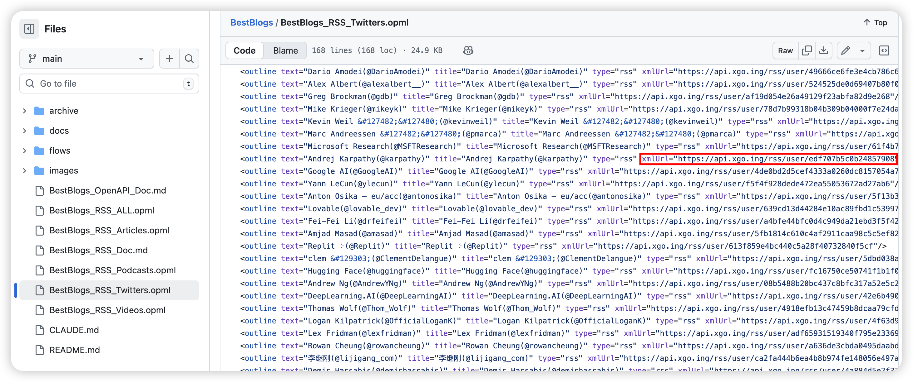

### Twitterは公式にRSSサービスを提供していません

### このアプリで使用されているTwitter RSSサービスはBestBlogsによって提供されており、現在無料です（ありがとうございます🙏）

### ユーザーは<mark>[BestBlogsリポジトリ](https://github.com/ginobefun/BestBlogs)</mark>にアクセスして、より多くのTwitter RSSフィードを見つけることができます

### 購読したいユーザーを見つけて、そのRSSリンクをコピーします

### リンクをページ上部のRSS URL入力ボックスに貼り付けて、追加ボタンをクリックすると購読できます

### BestBlogsで購読したいユーザーが見つからない場合は、BestBlogsプロジェクトのメンテナーに新しいフィードの追加を提案することができます
### または、<mark>[RSS.app](https://rss.app/)</mark>などの有料RSSサービスを使用することもできます

