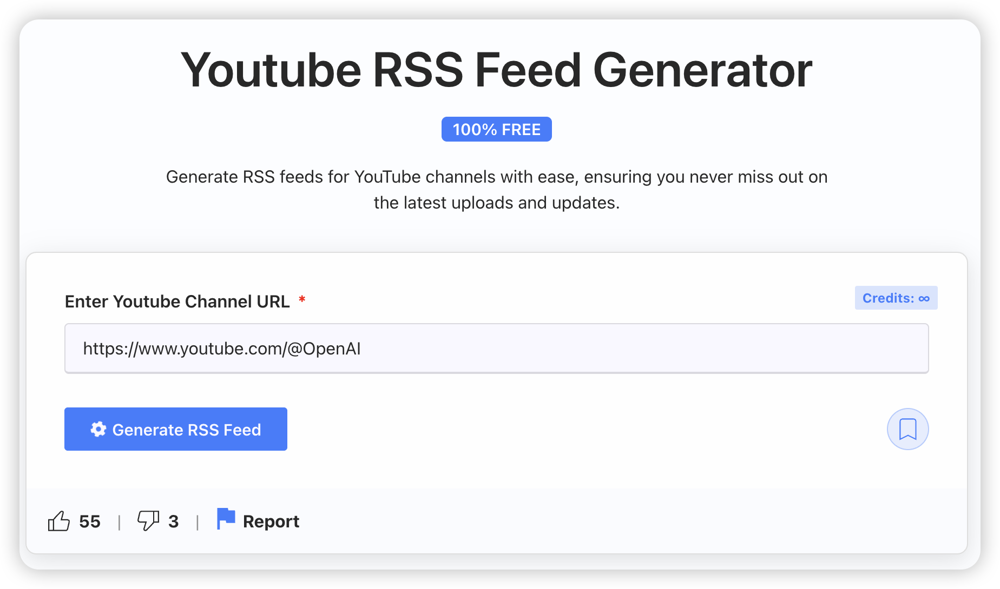

### YouTubeは公式にRSSサービスを提供しています🎉

### YouTubeチャンネルの購読方法とプレイリスト（ポッドキャスト）の購読方法は基本的に似ています

## チャンネル購読

### まず、購読したいYouTubeチャンネルページを開き、チャンネルのURLをコピーします

### <mark>[TubePilot](https://tubepilot.ai/tools/youtube-rss-feed-generator/)</mark>などのオンラインツールを使用して、チャンネルURLを入力し、生成ボタンをクリックします

### ウェブサイトがRSSフィードを生成します

### 生成されたフィードURLをページ上部のRSS URL入力ボックスに貼り付けて、追加ボタンをクリックすると購読できます

## プレイリスト購読

### チャンネルとは異なり、プレイリストのRSSフィード生成にはTubePilotは使用せず、<mark>[Youtube RSS Extractor](https://jeffkeeling.github.io/youtube_rss_extractor/)</mark>を使用します。プレイリストのURLを入力し、生成ボタンをクリックします。他の手順は同じです。

