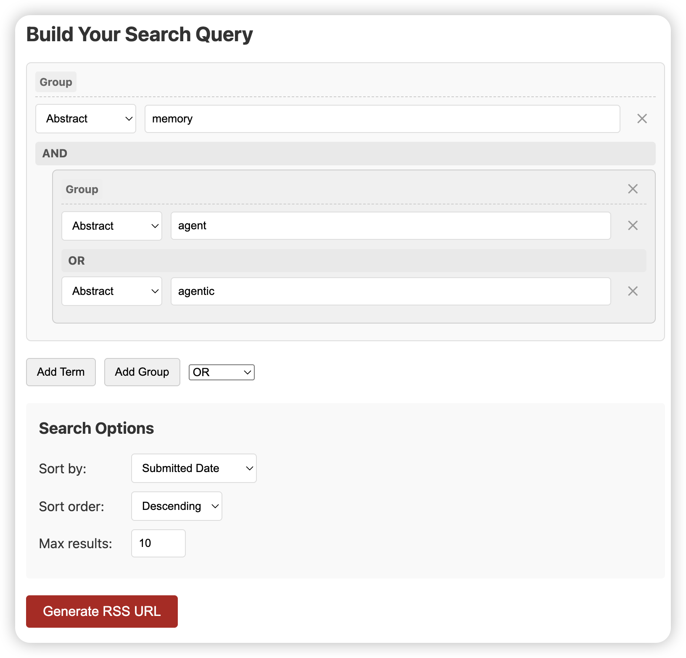
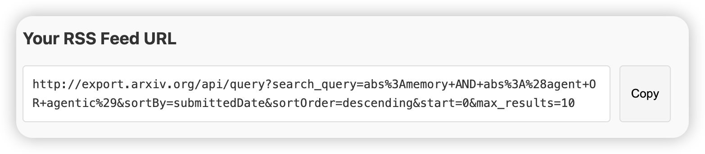

### arXiv官方提供了RSS服务

### 菜单栏中的alphaXiv可以帮助用户了解近期整个AI领域最热门的论文，这些论文可以说是必看的

### 而每个研究者或工程师都有自己主攻的细分领域，例如agent memory，reinforcement learning等。订阅arXiv RSS可以每天给您推送最新的，细分领域的论文，效果就和每天主动去arXiv上检索一样

### 建议使用开源的<mark>[arXiv RSS URL Generator](https://ronpay.github.io/arxiv-rss-feed-generator/)</mark>

### 为你的rss设定适当的search query，例如，我关注agent memory的研究论文，那么可以这样设置：

### 建议多摸索一下，尝试不同的search query，以获得最佳的检索效果

### 设置好后，点击Generate RSS URL，网站会生成一个RSS Feed URL

### 最后，把RSS Feed URL粘贴到页面上方的RSS URL输入框里，点击添加按钮，就能订阅了

### arXiv的RSS大概每天更新一次

