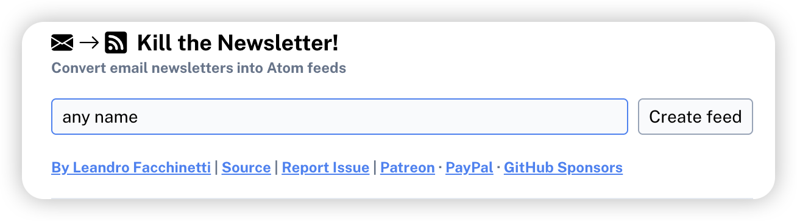
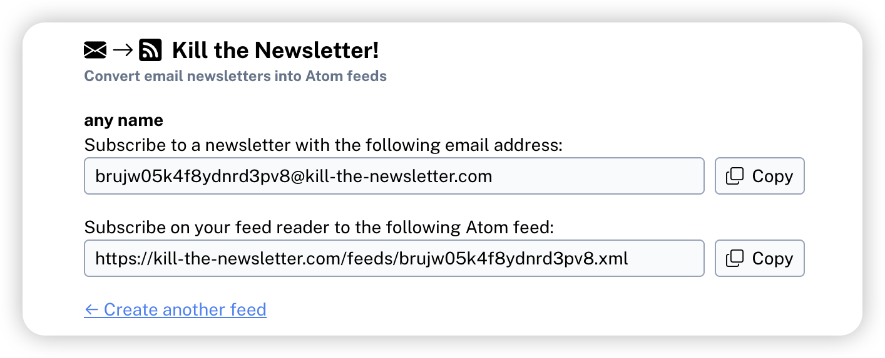
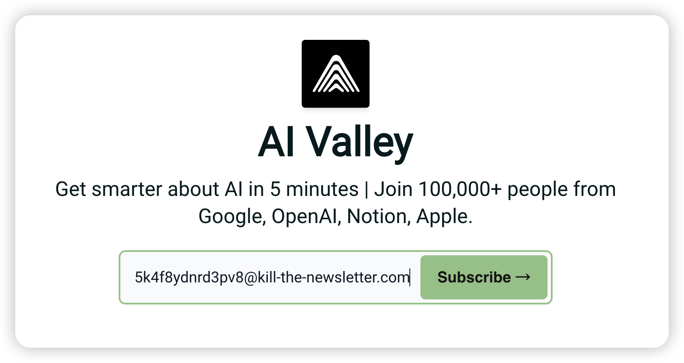

### 少数Newletter会自带RSS服务，如BestBlogs

### 对于大多数没有RSS功能的Nesletters，可以使用Kill the Newsletter来订阅它们, 目前是免费的（感谢🙏）

### 用户可以前往<mark>[Kill the Newsletter网站](https://kill-the-newsletter.com/)</mark>

### 给订阅源起一个名字，然后点击Create Feed

### 然后这个网站会给你生成一个虚拟的邮箱地址，和一个Atom feed

### 去你想订阅的Newsletter官网（这里以AI Valley举例），用Kill the Newsletter给你的虚拟邮箱地址订阅

### 最后，把Kill the Newsletter给你的Atom feed粘贴到页面上方的RSS URL输入框里，点击添加按钮，就能订阅了

### 订阅newsletter之后，一开始是没有内容的，这是正常情况，需要等收到第一份newletter后才会有

