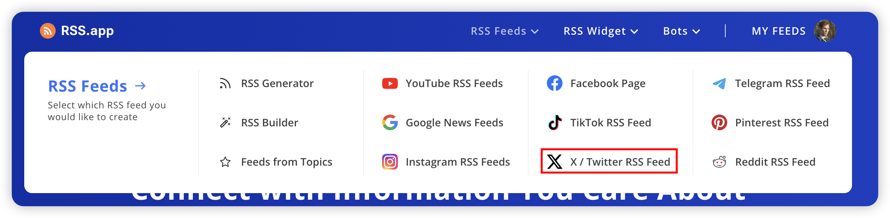

### Twitter官方不提供RSS服务

### 此应用中使用的Twitter RSS服务由BestBlogs提供，目前是免费的（感谢🙏）

### 用户可以前往<mark>[BestBlogs仓库](https://github.com/ginobefun/BestBlogs)</mark>寻找更多Twitter订阅源

### 找到你想订阅的用户，复制它的RSS链接

### 把链接粘贴到页面上方的RSS URL输入框里，点击添加按钮，就能订阅了

### 如果在BestBlogs里没有找到想订阅的用户，你可以尝试向BestBlogs项目的维护者建议添加新的订阅源
### 或者使用收费的RSS服务，如<mark>[RSS.app](https://rss.app/https://rss.app/)</mark>

