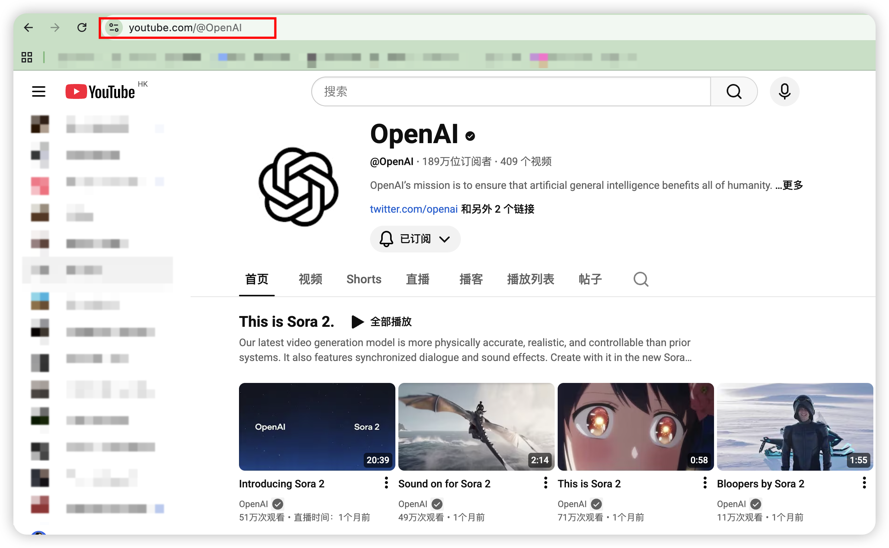
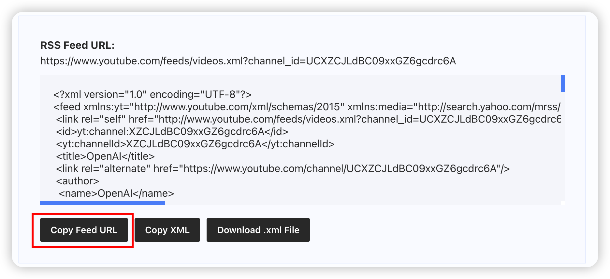

### YouTube proporciona servicio RSS oficialmente 🎉

### Los métodos de suscripción para canales de YouTube y listas de reproducción (podcasts) son básicamente similares

## Suscripción a Canal

### Primero, abre la página del canal de YouTube al que quieres suscribirte y copia la URL del canal

### Puedes usar herramientas en línea como <mark>[TubePilot](https://tubepilot.ai/tools/youtube-rss-feed-generator/)</mark>, ingresa la URL del canal y haz clic en el botón Generar

### El sitio web generará un feed RSS

### Pega la URL del feed generado en el cuadro de entrada de URL RSS en la parte superior de la página, haz clic en el botón Agregar para suscribirte

## Suscripción a Lista de Reproducción

### A diferencia de los canales, la generación de feed RSS de listas de reproducción no usa TubePilot, sino <mark>[Youtube RSS Extractor](https://jeffkeeling.github.io/youtube_rss_extractor/)</mark>. Ingresa la URL de la lista de reproducción y haz clic en el botón Generar. Los demás pasos son los mismos.

