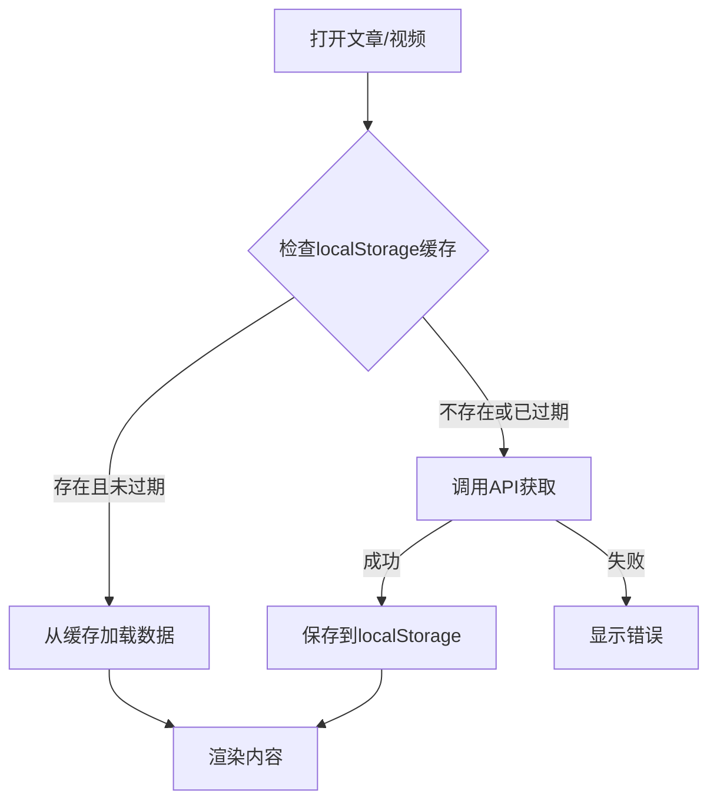

# YouTube字幕、AI摘要和引用持久化存储实现（更新版）

## 概述

为YouTube字幕、AI摘要和引用添加持久化存储功能，使用localStorage存储数据（与现有的feed图标缓存模式一致），实现缓存机制和过期策略，提升用户体验并减少API调用。

## 数据流

## 实现步骤

### 1. 在article.js中添加缓存工具函数

- 文件: `src/article/article.js`
- 功能:
  - 添加缓存前缀常量:
    - `YOUTUBE_TRANSCRIPT_CACHE_PREFIX = "youtube-transcript-"`
    - `YOUTUBE_SUMMARY_CACHE_PREFIX = "youtube-summary-"`
    - `YOUTUBE_QUOTES_CACHE_PREFIX = "youtube-quotes-"`
  - 添加过期时间常量: `TRANSCRIPT_CACHE_EXPIRY_DAYS = 30`
  - 实现字幕缓存函数:
    - `getCachedTranscript(videoId)` - 从localStorage读取字幕缓存
    - `saveCachedTranscript(videoId, transcript)` - 保存字幕到localStorage
  - 实现摘要缓存函数:
    - `getCachedSummary(videoId)` - 从localStorage读取摘要缓存
    - `saveCachedSummary(videoId, summary)` - 保存摘要到localStorage
  - 实现引用缓存函数:
    - `getCachedQuotes(videoId)` - 从localStorage读取引用缓存
    - `saveCachedQuotes(videoId, quotes)` - 保存引用到localStorage
  - 存储结构: `{ data: any, timestamp: number }`（与feed图标缓存模式一致）

### 2. 修改字幕获取逻辑

- 文件: `src/article/article.js`
- 修改 `fetchYouTubeTranscript(videoId)` 函数:
  - 首先调用 `getCachedTranscript(videoId)` 检查缓存
  - 如果缓存存在且未过期，直接返回缓存数据
  - 如果缓存不存在或已过期，调用API获取
  - API获取成功后，调用 `saveCachedTranscript(videoId, transcript)` 保存到缓存
  - 保持现有的错误处理逻辑

### 3. 修改AI摘要生成逻辑

- 文件: `src/article/article.js`
- 修改 `generateSummary(videoId)` 函数:
  - 在检查内存Map之前，先调用 `getCachedSummary(videoId)` 检查localStorage缓存
  - 如果缓存存在且未过期，直接返回并存储到内存Map
  - 如果缓存不存在或已过期，继续现有的生成流程
  - API生成成功后，调用 `saveCachedSummary(videoId, summary)` 保存到缓存
  - 保持现有的错误处理逻辑

### 4. 修改AI引用生成逻辑

- 文件: `src/article/article.js`
- 修改 `generateQuotes(videoId)` 函数:
  - 在检查内存Map之前，先调用 `getCachedQuotes(videoId)` 检查localStorage缓存
  - 如果缓存存在且未过期，直接返回并存储到内存Map
  - 如果缓存不存在或已过期，继续现有的生成流程
  - API生成成功后，调用 `saveCachedQuotes(videoId, quotes)` 保存到缓存
  - 保持现有的错误处理逻辑

### 5. 过期数据清理策略

- **采用与feed图标缓存相同的模式**：在读取时自动清理过期项（在所有 `getCached*` 函数中）
- 不需要专门的启动时清理函数，因为每次读取都会自动检查并删除过期项
- 如果确实需要启动时批量清理（作为维护操作），可以在 `src/scripts/models/app.ts` 的 `initApp()` 函数中添加，但这不是必需的

## 技术细节

### localStorage存储结构

- 字幕缓存:
  - 键名格式: `youtube-transcript-{videoId}`
  - 值格式: JSON字符串，包含 `{ transcript: TranscriptSegment[], timestamp: number }`
- 摘要缓存:
  - 键名格式: `youtube-summary-{videoId}`
  - 值格式: JSON字符串，包含 `{ summary: TranscriptSummary, timestamp: number }`
- 引用缓存:
  - 键名格式: `youtube-quotes-{videoId}`
  - 值格式: JSON字符串，包含 `{ quotes: JuiciestQuote[], timestamp: number }`
- 过期检查: 在读取时检查 `timestamp + 30天` 是否小于当前时间

### 缓存过期策略

- 默认过期时间: 30天
- **在读取时自动检查过期并删除过期项**（与feed图标缓存模式一致）
- 不需要专门的启动时清理，因为每次读取都会自动清理

### 错误处理

- 如果localStorage操作失败（如存储已满），降级到直接调用API
- 保持现有的错误处理逻辑不变
- 使用try-catch包裹所有localStorage操作，确保异常不影响功能

## 文件变更清单

1. **修改文件**:
   - `src/article/article.js` - 添加缓存工具函数，修改 `fetchYouTubeTranscript`、`generateSummary` 和 `generateQuotes` 函数

## 注意事项

- 保持向后兼容，如果localStorage不可用或操作失败，降级到直接API调用
- 字幕、摘要和引用数据可能较大，注意localStorage的存储限制（通常5-10MB）
- 过期清理在读取时自动进行（与feed图标缓存模式完全一致）
- 与现有的feed图标缓存模式保持一致，便于维护

## 与现有缓存模式的对比

现有feed图标缓存（`src/scripts/utils.ts`）:
- 使用localStorage
- 键前缀: `feed-icon-`
- 过期时间: 7天
- 存储结构: `{ iconUrl: string, timestamp: number }`
- **过期清理**: 在 `getCachedFeedIcon()` 读取时自动检查并删除过期项（第434-436行）
- **无启动时清理**: 不需要专门的清理函数

字幕缓存（新实现）:
- 使用localStorage（保持一致）
- 键前缀: `youtube-transcript-`
- 过期时间: 30天
- 存储结构: `{ transcript: TranscriptSegment[], timestamp: number }`
- **过期清理**: 在 `getCachedTranscript()` 读取时自动检查并删除过期项（与feed图标模式一致）
- **无启动时清理**: 不需要专门的清理函数

AI摘要缓存（新实现）:
- 使用localStorage（保持一致）
- 键前缀: `youtube-summary-`
- 过期时间: 30天
- 存储结构: `{ summary: TranscriptSummary, timestamp: number }`
- **过期清理**: 在 `getCachedSummary()` 读取时自动检查并删除过期项
- **无启动时清理**: 不需要专门的清理函数

AI引用缓存（新实现）:
- 使用localStorage（保持一致）
- 键前缀: `youtube-quotes-`
- 过期时间: 30天
- 存储结构: `{ quotes: JuiciestQuote[], timestamp: number }`
- **过期清理**: 在 `getCachedQuotes()` 读取时自动检查并删除过期项
- **无启动时清理**: 不需要专门的清理函数
